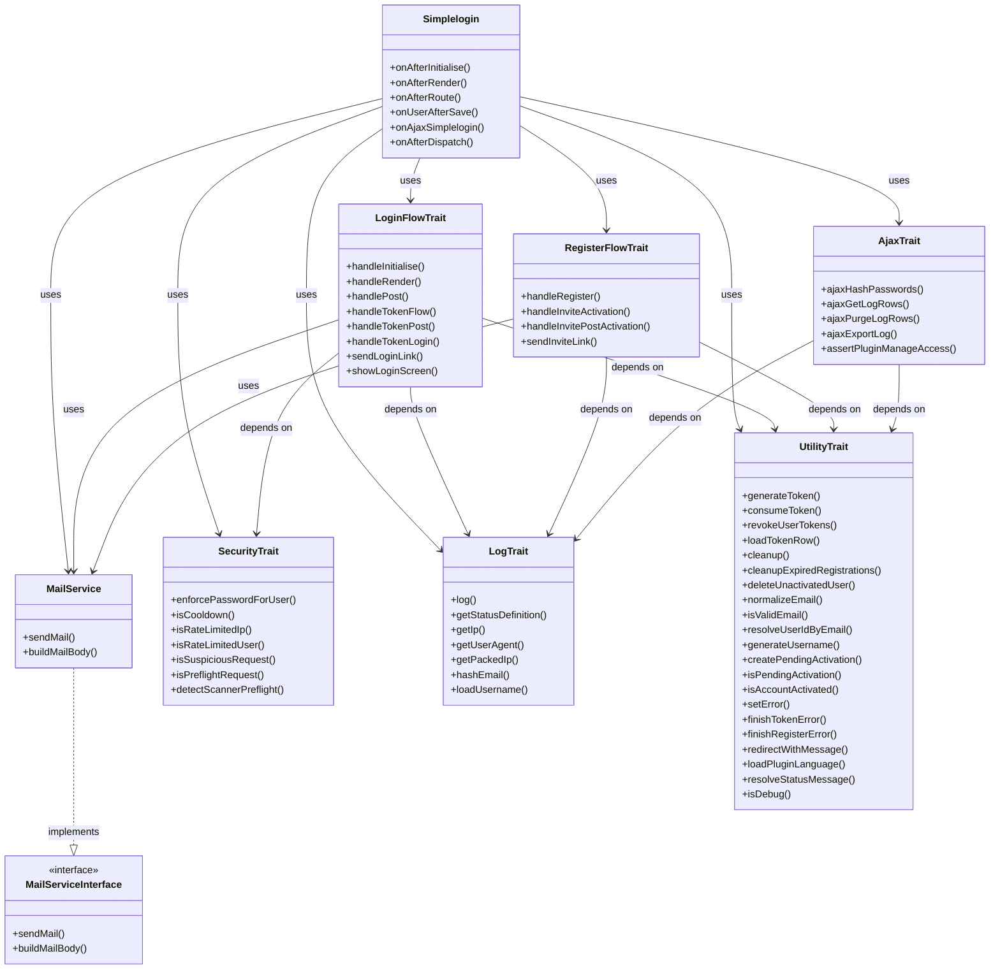
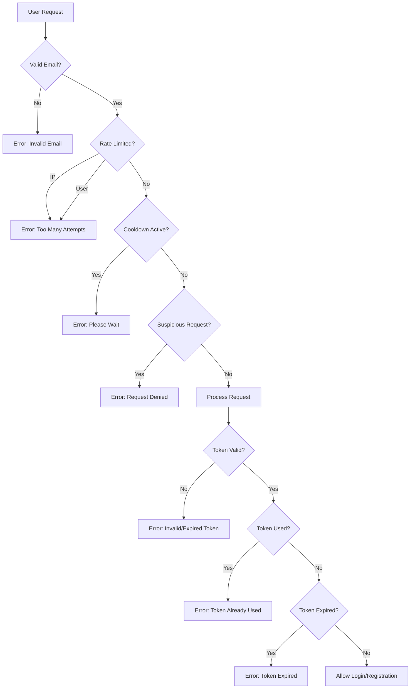
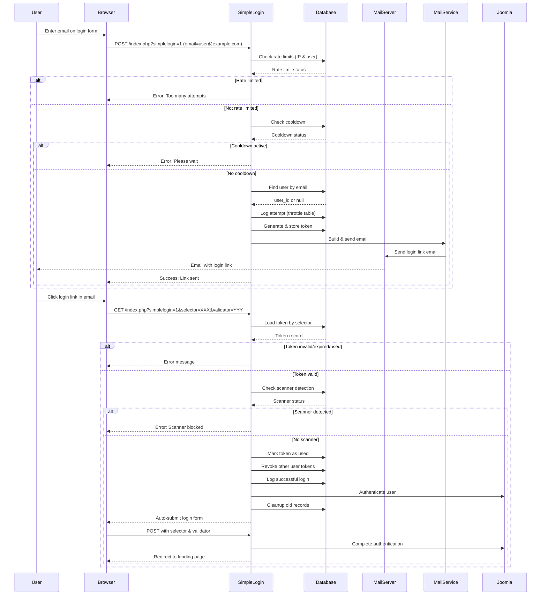
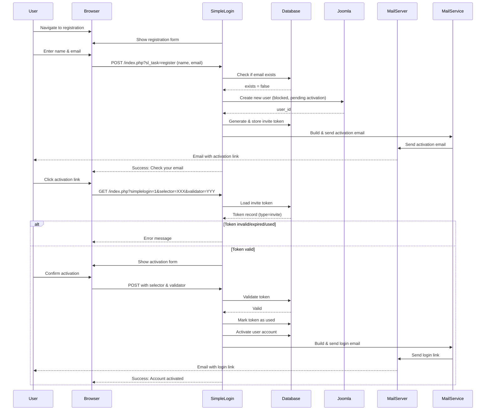
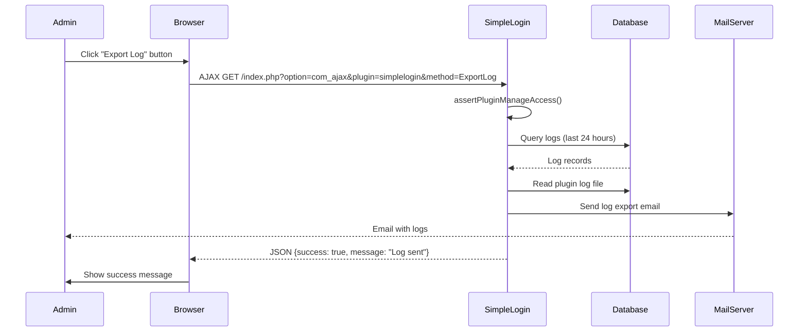

# SimpleLogin Plugin - Architecture Documentation

**Version:** 1.0.6  
**Last Updated:** July 8, 2026  
**Author:** Ad Stam (Product Owner)  
**Architect:** AI Assistant  
**Target Platform:** Joomla 5.4+ (PHP 8.1+)

---

## 📋 Table of Contents

1. [Overview](#overview)
2. [System Architecture](#system-architecture)
3. [Component Diagram](#component-diagram)
4. [Database Design](#database-design)
5. [File Structure](#file-structure)
6. [Class Structure](#class-structure)
7. [Security Architecture](#security-architecture)
8. [Data Flow](#data-flow)
9. [Configuration](#configuration)
10. [Dependencies](#dependencies)
11. [Future Considerations](#future-considerations)

---

## 🎯 Overview

### Purpose

SimpleLogin is a Joomla system plugin that enables **passwordless authentication** via email links. Users can log in to the frontend by requesting a secure login link sent to their email address. The plugin also supports **passwordless registration**, where new users can create accounts and receive an activation link via email.

### Key Features

- ✅ Passwordless login via email links
- ✅ Passwordless user registration
- ✅ Configurable link expiry (default: 15 minutes for login, 30 minutes for registration)
- ✅ Rate limiting (per IP and per user)
- ✅ Cooldown between requests
- ✅ Scanner/bot detection
- ✅ Comprehensive logging and auditing
- ✅ Multi-language support (English, Dutch)
- ✅ Optional password login fallback
- ✅ Customizable email templates
- ✅ Admin dashboard with logs and reports
- ✅ **NEW in 1.0.6**: Mail Service for centralized email handling
- ✅ **NEW in 1.0.6**: Registration configuration fieldset

### Target Audience

- **End Users**: Site visitors who want to log in without remembering passwords
- **Site Administrators**: Manage plugin configuration, view logs, monitor security
- **Developers**: Extend or customize plugin functionality

---

## 🏗️ System Architecture

### Architecture Pattern

The plugin follows a **modular service-based architecture** with separation of concerns:

```
┌─────────────────────────────────────────────────────────────┐
│                      SimpleLogin Plugin                          │
├─────────────────────────────────────────────────────────────┤
│  ┌─────────────────┐  ┌─────────────────┐  ┌────────────────┐ │
│  │   Main Plugin    │  │     Traits       │  │   Services      │ │
│  │   (Extension)    │  │ (Modular Logic)  │  │  (Dependency)    │ │
│  └─────────────────┘  └─────────────────┘  └────────────────┘ │
└─────────────────────────────────────────────────────────────┘
         │                        │                        │
         ▼                        ▼                        ▼
┌─────────────────┐ ┌─────────────────┐ ┌─────────────────┐
│  Event Handlers  │ │  Login Flow      │ │  Mail Service    │
│  (onAfterInit,   │ │  Register Flow   │ │  (Email Handling)│
│   onAfterRender) │ │  Security        │ │                 │
│                 │ │  Utility         │ │                 │
│                 │ │  Logging         │ │                 │
│                 │ │  AJAX            │ │                 │
└─────────────────┘ └─────────────────┘ └─────────────────┘
         │                        │                        │
         ▼                        ▼                        ▼
┌─────────────────────────────────────────────────────────────┐
│                      Joomla CMS Core                            │
└─────────────────────────────────────────────────────────────┘
```

### Design Principles

1. **Separation of Concerns**: Each service/trait handles a specific domain
2. **Single Responsibility**: Each method has one clear purpose
3. **Reusability**: Services can be reused in other plugins
4. **Maintainability**: Clear structure, well-documented code
5. **Security First**: All user input is validated, rate limiting prevents abuse
6. **Extensibility**: Easy to add new features without breaking existing functionality

---

## 📊 Component Diagram



---

## 🗃️ Database Design

### Entity-Relationship Diagram

```mermaid
erDiagram
    simple_login ||--o{ simple_login_throttle : "1-to-many"
    simple_login ||--o{ simple_login_log : "1-to-many"
    users ||--o{ simple_login : "1-to-many"
    users ||--o{ simple_login_throttle : "1-to-many"
    users ||--o{ simple_login_log : "1-to-many"
    
    simple_login {
        int id PK
        int user_id FK
        char(16) selector
        varchar(255) token
        enum('login','invite') type
        datetime created
        datetime expires
        tinyint(1) used
    }
    
    simple_login_throttle {
        bigint id PK
        int user_id FK
        varchar(150) username
        char(64) email_hash
        varbinary(16) ip
        varchar(50) status
        int login_id FK
        datetime created
    }
    
    simple_login_log {
        bigint id PK
        enum type
        int user_id FK
        varchar(150) username
        char(64) email_hash
        varbinary(16) ip
        varchar(512) user_agent
        varchar(50) status
        int login_id FK
        datetime created
    }
    
    users {
        int id PK
        varchar(150) username
        varchar(255) email
        varchar(255) password
        varchar(255) activation
        tinyint(1) block
        ...
    }
```

### Table Descriptions

#### `#__simple_login`

Stores login and registration tokens.


| Column     | Type                   | Description                       | Example               |
| ---------- | ---------------------- | --------------------------------- | --------------------- |
| `id`       | INT UNSIGNED           | Primary key                       | `1`                   |
| `user_id`  | INT UNSIGNED           | Joomla user ID                    | `42`                  |
| `selector` | CHAR(16)               | Public token identifier           | `a1b2c3d4e5f6g7h8`    |
| `token`    | VARCHAR(255)           | Hashed validator (password\_hash) | `$2y$10$...`          |
| `type`     | ENUM('login','invite') | Token purpose                     | `login`               |
| `created`  | DATETIME               | Creation timestamp                | `2026-07-05 10:00:00` |
| `expires`  | DATETIME               | Expiration timestamp              | `2026-07-05 10:15:00` |
| `used`     | TINYINT(1)             | Whether token was used            | `0` or `1`            |


**Indexes:**

- PRIMARY KEY: `id`
- UNIQUE: `selector` (prevents duplicate tokens)
- INDEX: `user_id`, `expires`, `used`

#### `#__simple_login_throttle`

Tracks request frequency for rate limiting and security monitoring.


| Column       | Type            | Description                   | Example                  |
| ------------ | --------------- | ----------------------------- | ------------------------ |
| `id`         | BIGINT UNSIGNED | Primary key                   | `1`                      |
| `user_id`    | INT UNSIGNED    | Joomla user ID (nullable)     | `42`                     |
| `username`   | VARCHAR(150)    | Username (nullable)           | `john.doe`               |
| `email_hash` | CHAR(64)        | SHA-256 hash of email         | `a1b2c3...`              |
| `ip`         | VARBINARY(16)   | IP address (IPv4/IPv6)        | `\x7F\x00\x00\x01`       |
| `status`     | VARCHAR(50)     | Action type                   | `login_attempt_existing` |
| `login_id`   | INT UNSIGNED    | Reference to simple\_login.id | `1`                      |
| `created`    | DATETIME        | Timestamp                     | `2026-07-05 10:00:00`    |


**Indexes:**

- PRIMARY KEY: `id`
- INDEX: `ip + created`, `user_id + created`, `login_id + created`, `status + created`

#### `#__simple_login_log`

Audit log for all plugin actions.


| Column       | Type            | Description                   | Example                         |
| ------------ | --------------- | ----------------------------- | ------------------------------- |
| `id`         | BIGINT UNSIGNED | Primary key                   | `1`                             |
| `type`       | ENUM            | Log category                  | `LoginFlow`, `SecurityIncident` |
| `user_id`    | INT UNSIGNED    | Joomla user ID (nullable)     | `42`                            |
| `username`   | VARCHAR(150)    | Username (nullable)           | `john.doe`                      |
| `email_hash` | CHAR(64)        | SHA-256 hash of email         | `a1b2c3...`                     |
| `ip`         | VARBINARY(16)   | IP address                    | `\x7F\x00\x00\x01`              |
| `user_agent` | VARCHAR(512)    | Browser user agent            | `Mozilla/5.0...`                |
| `status`     | VARCHAR(50)     | Specific action               | `token_hit`, `rate_limited_ip`  |
| `login_id`   | INT UNSIGNED    | Reference to simple\_login.id | `1`                             |
| `created`    | DATETIME        | Timestamp                     | `2026-07-05 10:00:00`           |


**Indexes:**

- PRIMARY KEY: `id`
- INDEX: `type + created`, `status + created`, `user_id`, `login_id`

### Log Types &amp; Statuses

The plugin categorizes logs into **7 types**:


| Type                | Description                  | Example Statuses                                           |
| ------------------- | ---------------------------- | ---------------------------------------------------------- |
| `AccountEvent`      | User account related events  | `password_updated`, `user_not_found`, `register_success`   |
| `DebugDiagnostics`  | Debug-only diagnostic info   | `invite_email_not_found`, `token_row_missing`              |
| `DebugFlowTrace`    | Debug flow tracing           | `core_login_blocked`, `simplelogin_triggered`              |
| `DebugRequestTrace` | Request parameter tracing    | `selector_xxx`, `validator_present_yes`                    |
| `InviteFlow`        | Registration/invitation flow | `invite_sent`, `invite_activated`, `invite_expired`        |
| `LoginFlow`         | Login flow events            | `link_request`, `link_sent`, `login_success`, `token_hit`  |
| `SecurityIncident`  | Security related events      | `rate_limited_ip`, `rate_limited_user`, `scanner_detected` |


---

## 📁 File Structure

```
plg_system_simplelogin/
├── CANVAS.md
├── script.php
├── simplelogin.xml
├── update.xml
│
├── src/
│   ├── Service/                    # NEW: Service layer
│   │   ├── MailService.php        # Email sending service
│   │   └── MailServiceInterface.php # Interface for MailService
│   │
│   └── Extension/
│       └── Simplelogin.php        # Main plugin class (updated)
│   │
│   ├── Field/                     # Custom form fields
│   │   ├── BodybuttonsField.php
│   │   ├── ExportlogField.php
│   │   ├── HashpasswordsField.php
│   │   ├── LogreportField.php
│   │   └── ThrottlereportField.php
│   │
│   ├── Helper/
│   │   └── ReportHelper.php
│   │
│   ├── Traits/                    # Modular functionality traits
│   │   ├── AjaxTrait.php
│   │   ├── LoginFlowTrait.php     # Updated: uses MailService
│   │   ├── LogTrait.php
│   │   ├── RegisterFlowTrait.php  # Updated: uses MailService
│   │   ├── SecurityTrait.php
│   │   └── UtilityTrait.php
│   │
│   └── tmpl/
│       ├── logs.php
│       ├── logs_table.php
│       └── throttle.php
│
├── services/
│   └── provider.php              # Updated: registers MailService
│
├── layouts/
│   └── simplelogin/
│       ├── overlay.php
│       └── register.php
│
├── language/
│   ├── en-GB/
│   │   ├── en-GB.plg_system_simplelogin.ini
│   │   └── en-GB.plg_system_simplelogin.sys.ini
│   └── nl-NL/
│       ├── nl-NL.plg_system_simplelogin.ini
│       └── nl-NL.plg_system_simplelogin.sys.ini
│
├── media/
│   └── js/
│       ├── bodybuttons.js        # Updated for tag insertion
│       ├── hashpasswords.js
│       └── logreport.js
│
└── sql/
    ├── install.mysql.utf8.sql
    └── uninstall.mysql.utf8.sql
```

---

## 🏛️ Class Structure

### Main Plugin Class: `Simplelogin`

**Namespace:** `StamPlusJ\Plugin\System\Simplelogin\Extension`  
**Extends:** `Joomla\CMS\Plugin\CMSPlugin`  
**Uses:** 6 Traits + 1 Service

#### Event Subscriptions

```php
public static function getSubscribedEvents(): array
{
    return [
        'onAfterInitialise' => 'onAfterInitialise',
        'onAfterRender'     => 'onAfterRender',
        'onAfterRoute'      => 'onAfterRoute',
        'onUserAfterSave'   => 'onUserAfterSave',
        'onAjaxSimplelogin' => 'onAjaxSimplelogin',
        'onBeforeRender'    => 'onBeforeRender',
        'onAfterDispatch'   => 'onAfterDispatch',
    ];
}
```

#### Dependencies

**NEW in 1.0.6**: The plugin now injects `MailServiceInterface` via constructor:

```php
public function __construct(
    $dispatcher,
    array $config,
    MailServiceInterface $mailService  // NEW: Injected service
) {
    parent::__construct($dispatcher, $config);
    $this->mailService = $mailService;
    // ...
}
```

---

### Service Layer (NEW in 1.0.6)

#### MailService

**Namespace:** `StamPlusJ\Plugin\System\Simplelogin\Service`  
**Implements:** `MailServiceInterface`

**Responsibilities:**

- Centralized email sending functionality
- Email template building with placeholder replacement
- Reusable for all email types (login, invite, admin notifications)

**Methods:**

- `sendMail(string $recipient, string $subject, string $body): bool`
- `buildMailBody(string $template, array $placeholders): string`

**Usage:**

- Replaces duplicated email logic in `LoginFlowTrait::sendLoginLink()`
- Replaces duplicated email logic in `RegisterFlowTrait::sendInviteLink()`
- Replaces `RegisterFlowTrait::buildMailBody()` (now centralized)

---

### Custom Form Fields

## 🔒 Security Architecture

### Security Layers



### Security Features

#### 1. Token Security

- **Selector**: 16-character random hex string (public identifier)
- **Validator**: 64-character random hex string (secret, sent via email)
- **Token**: Password-hashed validator stored in database
- **Expiry**: Configurable (default: 15 min for login, 30 min for registration)
- **Single Use**: Tokens are marked as used after first successful authentication
- **Revocation**: All other tokens for a user are revoked when one is used

#### 2. Rate Limiting

**IP-based Rate Limiting:**

- Configurable max requests per IP address
- Configurable time window (default: 5 minutes)
- Blocks further attempts when limit is reached

**User-based Rate Limiting:**

- Configurable max requests per user
- Configurable time window (default: 10 minutes)
- Blocks further attempts when limit is reached

#### 3. Cooldown

- Configurable minimum wait time between requests (default: 30 seconds)
- Prevents rapid successive attempts
- Applied per IP and per user

#### 4. Scanner Detection

- **User Agent Analysis**: Detects bots, scanners, CLI tools
  - Blocked patterns: curl, wget, python, bot, spider, scanner, headless, phantom, httpclient, libwww
- **Request Frequency**: Detects rapid token hits (more than 5 in 2 seconds)
- **Preflight Detection**: Identifies scanner preflight requests before token validation

#### 5. Password Enforcement

- When password login is disabled (`allow_password_login = 0`):
  - All non-admin frontend user passwords are automatically hashed with random values
  - Makes password login impossible even if someone tries
  - Admin users retain their original passwords

#### 6. Data Privacy

- **Email Hashing**: Emails stored as SHA-256 hashes in throttle and log tables
- **IP Storage**: IPs stored as binary (VARBINARY(16)) for efficient querying
- **User Agent**: Truncated to 512 characters

### Security Configuration Options


| Parameter                  | Default | Description                            |
| -------------------------- | ------- | -------------------------------------- |
| `expiry_minutes`           | 15      | Login link validity in minutes         |
| `invite_expiry_minutes`    | 30      | Registration link validity in minutes  |
| `request_cooldown_seconds` | 30      | Minimum wait between requests          |
| `rate_limit_ip_max`        | 10      | Max requests per IP in window          |
| `rate_limit_ip_window`     | 5       | IP rate limit window in minutes        |
| `rate_limit_user_max`      | 5       | Max requests per user in window        |
| `rate_limit_user_window`   | 10      | User rate limit window in minutes      |
| `throttle_cleanup_time`    | 60      | Throttle table retention in minutes    |
| `log_retention_days`       | 30      | Log table retention in days            |
| `allow_password_login`     | 0       | Allow password login (0 = no, 1 = yes) |


---

## 🔄 Data Flow

### Login Flow



### Registration Flow



### Admin AJAX Flow



---

## ⚙️ Configuration

### Plugin Parameters

The plugin provides extensive configuration through Joomla's plugin parameters system.

#### General Settings


| Parameter              | Type      | Default    | Description                                  |
| ---------------------- | --------- | ---------- | -------------------------------------------- |
| `landing_page_option`  | Radio     | `homepage` | Landing page after login: homepage or custom |
| `landing_itemid`       | Menu Item | -          | Custom landing page menu item ID             |
| `allow_password_login` | Radio     | `0`        | Allow password login (0 = no, 1 = yes)       |
| `bulk_hash_passwords`  | Button    | -          | Hash all frontend user passwords             |


#### Login Mail Settings


| Parameter            | Type     | Default                  | Description                                               |
| -------------------- | -------- | ------------------------ | --------------------------------------------------------- |
| `mail_login_subject` | Text     | `Here's your login link` | Email subject for login links                             |
| `mail_login_body`    | Textarea | Template                 | Email body template. Supports `#name`, `#link`, `#expiry` |


#### Invitation Mail Settings


| Parameter             | Type     | Default                  | Description                                               |
| --------------------- | -------- | ------------------------ | --------------------------------------------------------- |
| `mail_invite_subject` | Text     | `Your confirmation link` | Email subject for registration links                      |
| `mail_invite_body`    | Textarea | Template                 | Email body template. Supports `#name`, `#link`, `#expiry` |


#### Registration Settings (NEW in 1.0.6)


| Parameter                   | Type            | Default                         | Description                                                                              |
| --------------------------- | --------------- | ------------------------------- | ---------------------------------------------------------------------------------------- |
| `require_admin_approval`    | Radio           | `0`                             | Require admin approval for registrations                                                 |
| `notify_admin_registration` | Radio           | `0`                             | Notify admin about new registrations                                                     |
| `mail_admin_subject`        | Text            | `New registration on #sitename` | Subject for admin notification email                                                     |
| `mail_admin_body`           | Textarea        | Template                        | Body for admin notification email. Supports `#name`, `#email`, `#sitename`, `#adminlink` |


#### Security Settings

**Base Limits:**


| Parameter                  | Type   | Default | Description                              |
| -------------------------- | ------ | ------- | ---------------------------------------- |
| `expiry_minutes`           | Number | `15`    | Login link validity in minutes           |
| `invite_expiry_minutes`    | Number | `30`    | Registration link validity in minutes    |
| `request_cooldown_seconds` | Number | `30`    | Minimum wait between requests in seconds |


**Rate Limits:**


| Parameter                | Type   | Default | Description                       |
| ------------------------ | ------ | ------- | --------------------------------- |
| `rate_limit_ip_max`      | Number | `10`    | Max requests per IP in window     |
| `rate_limit_ip_window`   | Number | `5`     | IP rate limit window in minutes   |
| `rate_limit_user_max`    | Number | `5`     | Max requests per user in window   |
| `rate_limit_user_window` | Number | `10`    | User rate limit window in minutes |


#### Sessions Settings


| Parameter               | Type   | Default | Description                      |
| ----------------------- | ------ | ------- | -------------------------------- |
| `throttle_cleanup_time` | Number | `60`    | Record retention time in minutes |
| `throttle_report`       | Custom | -       | View throttle table records      |


#### Logging Settings


| Parameter            | Type   | Default | Description                                |
| -------------------- | ------ | ------- | ------------------------------------------ |
| `log_retention_days` | Number | `30`    | Log retention period in days               |
| `log_report`         | Custom | -       | View log table records                     |
| `log_export`         | Button | -       | Export logs (last 24 hours) to admin email |


### Custom Field Types

The plugin implements several custom form field types:


| Field Type        | File                     | Description                                |
| ----------------- | ------------------------ | ------------------------------------------ |
| `bodybuttons`     | BodybuttonsField.php     | Adds buttons for email template variables  |
| `exportlog`       | ExportlogField.php       | Export log button with status              |
| `hashpasswords`   | HashpasswordsField.php   | Bulk hash all frontend passwords           |
| `logreport`       | LogreportField.php       | Display log table with filters             |
| `throttlereport`  | ThrottlereportField.php  | Display throttle table records             |


---

## 📦 Dependencies

### Joomla Core Dependencies

- **Joomla CMS**: 5.4 or higher
- **PHP**: 8.1 or higher
- **Database**: MySQL 8.0+ (with utf8mb4 support)

### PHP Extensions

- `pdo_mysql` - Database connectivity
- `filter` - Email validation
- `hash` - Password hashing
- `json` - JSON encoding/decoding
- `random` - Secure random number generation

### Joomla Libraries Used

- `Joomla\CMS\Plugin\CMSPlugin` - Base plugin class
- `Joomla\CMS\Factory` - Application and service access
- `Joomla\CMS\Language\Text` - Language string handling
- `Joomla\CMS\Router\Route` - URL routing
- `Joomla\CMS\Uri\Uri` - URI manipulation
- `Joomla\CMS\User\UserFactoryInterface` - User management
- `Joomla\CMS\HTML\HTMLHelper` - HTML generation
- `Joomla\CMS\Log\Log` - Logging
- `Joomla\CMS\Session\Session` - Session management
- `Joomla\CMS\Mailer\Mailer` - Email sending (via Factory)
- `Joomla\DI\Container` - Dependency injection
- `Joomla\Event\DispatcherInterface` - Event dispatching

---

## 🚀 Future Considerations

### Potential Improvements

#### 1. Enhanced Security

- **2FA Integration**: Add two-factor authentication as an additional layer
- **IP Whitelisting/Blacklisting**: Allow administrators to manage IP restrictions
- **Geolocation Tracking**: Log and display user locations for security monitoring
- **Anomaly Detection**: Implement machine learning-based anomaly detection

#### 2. User Experience

- **Remember Device**: Allow users to skip email verification on trusted devices
- **Multiple Email Addresses**: Support multiple email addresses per user
- **Social Login Integration**: Add OAuth support (Google, Facebook, etc.)
- **Mobile App Support**: Add deep linking for mobile applications

#### 3. Administration

- **Dashboard Widgets**: Add overview widgets to Joomla admin dashboard
- **User Management Integration**: Integrate with com\_users for user management
- **Export/Import Configuration**: Allow configuration backup and restore
- **Multi-Site Support**: Support for Joomla multi-site installations

#### 4. Performance

- **Caching**: Cache frequently accessed data (rate limits, user info)
- **Queue System**: Use job queue for email sending in high-traffic sites
- **Database Optimization**: Add additional indexes for large installations
- **Lazy Loading**: Implement lazy loading for admin interfaces

#### 5. Extensibility

- **Plugin API**: Create a public API for third-party integrations
- **Event System**: Add more events for developers to hook into
- **Template Overrides**: Allow template overrides for email templates
- **Custom Field Types**: Support for custom user fields during registration

#### 6. Compliance

- **GDPR Compliance**: Add data export and deletion features
- **Audit Trail**: Enhanced audit logging for compliance requirements
- **Data Retention Policies**: Configurable data retention per type
- **Consent Management**: Track user consent for email communications

### Technical Debt (Updated for 1.0.6)

Based on the code analysis, the following has been addressed in Sprint 1:

✅ **RESOLVED in 1.0.6**:

1. **Duplicated mail logic** - Extracted to MailService
2. **Commented-out registration fieldset** - Restored in simplelogin.xml

🔄 **Remaining Technical Debt**:

1. **Code Organization**
  - Some methods in traits are quite long and could be refactored into smaller, more focused methods
  - Consider extracting TokenService from UtilityTrait for better separation of concerns
2. **Documentation**
  - Add PHPDoc comments for all public and protected methods in traits
  - Document the trait dependencies more clearly
3. **Testing**
  - Implement unit tests for critical functionality (MailService is now testable!)
  - Add integration tests for the complete flows
4. **Error Handling**
  - Standardize error messages and codes
  - Add more detailed error logging for debugging
5. **Performance**
  - Review database queries for optimization opportunities
  - Consider adding caching for frequently accessed data

---

## 📖 Appendix

### A.1 Token Generation Process

1. Generate 8-byte random selector: `bin2hex(random_bytes(8))`
2. Generate 32-byte random validator: `bin2hex(random_bytes(32))`
3. Hash validator with PASSWORD\_DEFAULT: `password_hash($validator, PASSWORD_DEFAULT)`
4. Store selector, hashed token, user\_id, type, expiry in database
5. Send selector and validator in email link: `?selector=XXX&validator=YYY`

### A.2 Email Template Variables


| Variable     | Description                 | Example                              |
| ------------ | --------------------------- | ------------------------------------ |
| `#name`      | User's name                 | `John Doe`                           |
| `#link`      | Login/activation link       | `https://site.com/...`               |
| `#expiry`    | Link validity in minutes    | `15`                                 |
| `#sitename`  | Site name                   | `My Joomla Site`                     |
| `#adminlink` | Admin users management link | `https://site.com/administrator/...` |
| `#email`     | User's email address        | `john@example.com`                   |


### A.3 Mail Service Usage

**Before (duplicated code):**

```php
// In LoginFlowTrait:
$mailer = Factory::getMailer();
$config = $app->getConfig();
$mailer->setSender([$config->get('mailfrom'), $config->get('fromname')]);
$mailer->addRecipient($email);
$mailer->setSubject($subject);
$mailer->setBody($body);
$mailer->send();

// In RegisterFlowTrait (same code duplicated):
$mailer = Factory::getMailer();
$config = $app->getConfig();
$mailer->setSender([$config->get('mailfrom'), $config->get('fromname')]);
// ... etc
```

**After (centralized in MailService):**

```php
// In LoginFlowTrait:
$this->mailService->sendMail($email, $subject, $body);

// In RegisterFlowTrait:
$this->mailService->sendMail($email, $subject, $body);
```

### A.4 Database Schema Version

Current schema version: **1.0** (as of plugin version 1.0.6)

### A.5 Compatibility Matrix


| Joomla Version | PHP Version | Status          |
| -------------- | ----------- | --------------- |
| 5.4+           | 8.1+        | ✅ Supported     |
| 5.3            | 8.1+        | ❌ Not tested    |
| 5.2            | 8.0+        | ❌ Not supported |
| 4.x            | 8.0+        | ❌ Not supported |


---

*Documentation generated on July 8, 2026 | Plugin version: 1.0.6*